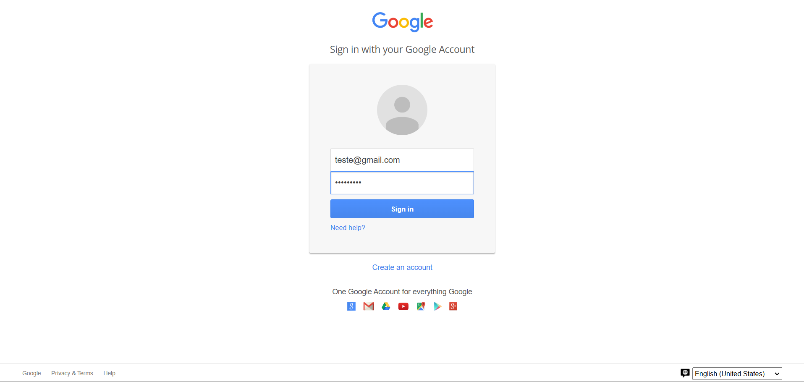
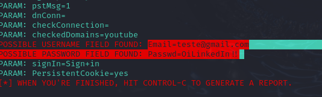

# Ethical Phishing 1

# PT-BR

## Objetivo
O objetivo desta simulação é capturar credenciais de usuários usando uma página de phishing baseada em um template web.

## Ferramentas Utilizadas
- Máquina virtual (VirtualBox)
- Kali Linux
- SEToolkit (Ferramenta com várias funcionalidades, inclusive a de clonagem de páginas para realizar testes)

## Configurações Iniciais
1. **Configurações da Máquina Virtual**:
   - Na VM: `Configurações -> Rede -> Selecionar a opção 'Placa em modo Bridge'`.

## Configurando o Phishing no Kali Linux
1. **Acesso Root**:
   - Obtenha acesso root:
     ```sh
     sudo su
     ```

2. **Iniciando o SEToolkit**:
   - Inicie o SEToolkit:
     ```sh
     setoolkit
     ```

3. **Tipo de Ataque**:
   - Selecione "Social-Engineering Attacks".

4. **Vetor de Ataque**:
   - Selecione "Credential Harvester Attack Method".

5. **Web Templates**:
   - Selecione "Web Templates".

6. **Configuração de Rede**:
   - Verifique o endereço IP da sua máquina:
     ```sh
     ifconfig
     ```
   - O SEToolkit já recomendará o IP da máquina automaticamente.

7. **Escolha do Template**:
   - Selecione "Google" como o template de web para clonar.

## Teste Local
1. Abra um navegador em sua máquina virtual e acesse o endereço IP que você anotou (por exemplo, `http://192.168.0.100`).
2. Verifique se a página de login do Google está carregando corretamente e se os formulários estão funcionando.
   
   - 

## Resultados
Nesta simulação, foram capturadas credenciais de teste inseridas na página de login clonada da Google.
- 

## Aviso Legal
**IMPORTANTE:** Esta simulação é realizada em um ambiente controlado para fins educacionais. O uso não autorizado é ilegal e antiético.

# EN

## Objective
The objective of this simulation is to capture user credentials using a phishing page based on a web template.

## Tools Used
- Virtual machine (VirtualBox)
- Kali Linux
- SEToolkit (a tool with various functionalities, including page cloning for testing purposes)

## Initial Setup
1. **Virtual Machine Configuration**:
   - In the VM: `Settings -> Network -> Select 'Bridged Adapter'`.

## Configuring Phishing on Kali Linux
1. **Root Access**:
   - Obtain root access:
     ```sh
     sudo su
     ```

2. **Starting SEToolkit**:
   - Start SEToolkit:
     ```sh
     setoolkit
     ```

3. **Type of Attack**:
   - Select "Social-Engineering Attacks".

4. **Attack Vector**:
   - Select "Credential Harvester Attack Method".

5. **Web Templates**:
   - Select "Web Templates".

6. **Network Configuration**:
   - Check your machine's IP address:
     ```sh
     ifconfig
     ```
   - SEToolkit will automatically recommend the IP address.

7. **Select Template**:
   - Select "Google" as the web template to clone.

## Local Testing
1. Open a browser on your virtual machine and access the IP address that you noted (e.g., `http://192.168.0.100`).
2. Ensure the Google login page loads correctly and the forms are functional.
   
   - 

## Results
In this simulation, test credentials entered on the cloned Google login page were captured.
- 

## Legal Disclaimer
**IMPORTANT:** This simulation is conducted in a controlled environment for educational purposes only. Unauthorized use is illegal and unethical.
